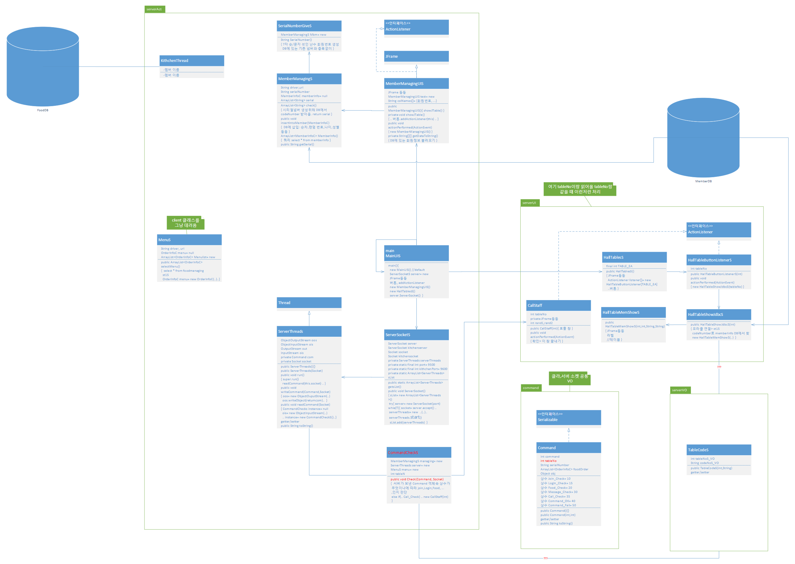

## food order
ì†ë‹˜ ì‹íƒì—ì„œ 패드 등으로 주문하면
í™€ì— ìˆëŠ” 서버로 넘어가는  ë°©ì‹
메뉴, 회ì›ë²ˆí˜¸ ë“±ì€ DBì— ìˆ˜ë¡

1. 2016.1.22 ~ 2.1
2. 2016.5.17 ~ 6.7

## contributor
- client: 진ì¬ê·¼, ì´ì„ ë¯¼, ë³€ê
- server: 변경섭, 김형준, 최병태
- helper: ì„진 (thread, VO, etc.)

## struct
- server_hall

- client_visitor, kitchen

